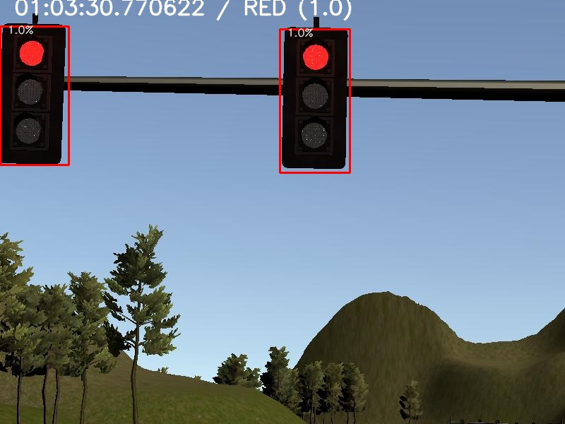

[//]: # (Image References)
[arch_image]: ./resources/carla_architecture.png
[vehicle]: ./resources/vehicle.jpg
[red_light]: ./resources/img-01-03-30-770622.jpg
[green_light]: ./resources/img-01-04-23-096548.jpg
[animation]: ./resources/animation.gif
[demo]: ./resources/demo.png
[timeline]: ./resources/timeline.png
[analysis]: ./resources/analysis.jpg

# Udacity Self-Driving Car Engineer Nanodegree

![][vehicle]

## Team: Project Herbie
<table>
 <tr>
    <th>Member</th>
    <th>Email</th>
    <th>&nbsp;</th>
 </tr>
 <tr>
    <td>James Singh</td>
    <td>james.singh@hotmail.com</td>
    <td> </td>
 </tr>
 <tr>
    <td>Emil Ibrahim</td>
    <td>emilkaram@gmail.com</td>
    <td> </td>
 </tr>
 <tr>
    <td>Mariam Swetha George</td>
    <td>mariam.george@nexteer.com</td>
    <td> </td>
 </tr>
</table>

This is the Capstone Project for Udacity's Self-Driving Car NanoDegree Program. We as a team used ROS (Robotic Operating System) to implement several nodes that built out the core functionality of the autonomous vehicle system, including traffic light detection, control, and waypoint following. This software we developed will be tested on Carla, the Udacity Self Driving Car, which should be able to drive autonomously on a test track.

For setup and development contribution, refer to [CONTRIBUTING.md](./CONTRIBUTING.md)

## ROS Implementation

ROS is an open-source, meta-operating system used for controlling robotics. It provides the services one would expect from an operating system, including hardware abstraction, low-level device control, implementation of commonly-used functionality, message-passing between processes, and package management. ROS *processes* are represented as *nodes* in a graph structure, connected by edges called *topics*. ROS nodes can pass messages to one another through topics, make service calls to other nodes, provide a service for other nodes, or set or retrieve shared data from a communal database.

ROS was used as the backbone for this project and the following is a system architecture diagram showing the ROS nodes and topics used in the project (taken from course resources):

![][arch_image]

Each of the nodes were coded in Python for the project and all the code can be found in the `ros/src` directory.
### Perception

The perception subsystem is handled by two ROS nodes ``obstacle detection`` and ``traffic light detection``. For the purposes of this project, we focused on the traffic light detection node. This node subscribes to the following topics:
* `/base_waypoints` : provides the complete list of waypoints for the course.
* `/current_pose` : provides the vehicle's current location.
* `/image_color` : provides an image stream from the car's camera which are then used to determine the traffic lights status
* `/vehicle/traffic_lights` : provides the (x, y, z) coordinates of all traffic lights.
This node publishes then the index of the waypoint for nearest upcoming red light's stop line to the topic: `/traffic_waypoint` which is then used by the planning subsystem to decide on a stop or not

### Planning

The planning subsystem comprises of two ROS nodes `waypoint loader` and `waypoint updater`. The former was already provided as a package that loads the static waypoint data and publishes to `/base_waypoints` topic.

The `waypoint updater` node updates the target velocity property of each waypoint based on traffic light and obstacle detection data. This node subscribes to the following topics :
* `/base_waypoints`
* `/current_pose` 
* `/traffic_waypoint`
The node then publishes to the `final_waypoints` topic a list of waypoints ahead of the car with target velocities. This feeds into the control subsystem which ultimately executes maneuvers on the car.

### Control

The control subsystm consists of two ROS nodes `DBW` and `waypoint follower`. Here too the later was already as a package from Autoware which subscribes to the `/final_waypoints` topic and then publishes the target linear and angular velocities of the vehicle in the form of twist commands to the `/twist_cmd` topic.

The `DBW` node controls the drive-by-wire system in Carla which allows for electronic control of the throttle, brake and steering. This node subscribes to:
* `/current_velocity` : provides linear velocity 
* `/twist_cmd` : provides angular velocity
* `/vehicle/dbw_enabled` : identifies if the car is under dbw or driver control
The node utilizes a variety of controllers to then to provide the appropriate throttle, brake, and steering commands. These commands are then published to the appropriate topics: `/vehicle/throttle_cmd`, `/vehicle/brake_cmd` and`/vehicle/steering_cmd`


## Code Flow

Each of these nodes are associated with python code that allows us to control and modify their behavior. In order to get the ideal behavior for the car, we modified the code in the following manner:

### **Waypoint Updater node (Partial)**
Created a node that subscribes to `/base_waypoints` and `/current_pose` and publishes to `/final_waypoints`. The node will eventually  publish a fixed number of waypoints ahead of the vehicle with the correct target velocities, depending on traffic lights and obstacles. But for a first pass, to enable movement, we added subscription to the topics and also publish just a fixed number of waypoints currently ahead of the vehicle. This is achieved by modifiying the `ros/src/waypoint_updater/waypoint_updater.py`

### **DBW node**
Once messages are being published to `/final_waypoints`, the vehicle's waypoint follower will publish twist commands to the `/twist_cmd` topic. The `/twist_cmd` is then used by the `DBW` node which uses various controllers to provide appropriate throttle, brake, and steering commands. This is achieved by modifying the `ros/src/twist_controller/dbw_node.py` which implements the subscription and publishing. The code also imports the `Controller` class from `ros/src/twist_controller/twist_controller.py` which will be used for implementing the necessary controller for the car.

### **Traffic Light Detection node**
For intial testing purposes the `/vehicle/traffic_lights` topic provides realtime updates for the current location and status of all the traffic lights in the simulation. This is then used to implememt the complete `Waypoint Updater` node (Step 4) to ensure that the car stops appropriately and safely for the different traffic lights. This is achieved by setting the keyword `TEST_MODE_ENABLED` to be *True*.

Once that is done, the `tl_detector.py` and `tl_classifier.py` codes are further modified for:
* `tl_detector.py`: To detect the incoming camera images and the traffic light data. This code utilizes the light classifier to get a color prediction, and publishes the location of any upcoming red lights.
* `tl_classifier.py`: This code implements the traffic light classication which involves both the identification of traffic lights and then classify them with as *red*, *yellow*, *green* or *unknown*.

For the classifier, we are using [TensorFlow Object Detection API](https://github.com/opencv/opencv/wiki/TensorFlow-Object-Detection-API) to retrieve information from the received image. The information include:

1. Number of objects detected
2. Score of objects detected (between 0.0 and 1.0)
3. Detection boxes (A set of bounding boxes each represented by a [1x4] vector consisting of the bounding box's end coordinates)
4. Detection classes (defines what object was detected. Eg. a car, a person, a traffic light etc)

We are constructing a JSON object constructed on the basis of above information and a few more in `tl_classifier.py`. This JSON data is used in `tl_detector` to generate a processed image file with traffic light information on it. The image files are saved to `<base folder>/images` folder, and the logs are written to `<base folder>/master.log` file.
```
{
    "lights": {
        "green": {"count": 2, "sum": 1.98, "average": 0.99202722311019897},
        "red": {"count": 0, "sum": 0.0, "average": 0.0},
        "final": {"color": "GREEN", "average": 0.99, "state": 2}
    },
    "boxes": [
        {"xmin": 312, "score": 0.99, "ymin": 122, "ymax": 287, "xmax": 393},
        {"xmin": 652, "score": 0.99, "ymin": 140, "ymax": 295, "xmax": 731}
    ],
    "filename": "../../../../images/img-01-49-57-974795.jpg",
    "waypoints": {"current": 747, "traffic_light": 753},
    "time": {"dashed": "01-49-57-974795", "colon": "01:49:57.974795"}
}
```

Here are some image files that were written to the `images` folder showing the timestamp the image was received by the application, the label for the detected image, the bounding boxes, the class of the identified image (Red, Yellow, Green, Unknown), and a confidence (between 0.0 and 1.0).




The below GIF file was constructed from the processed images, and depicts the image seen from the car's camera (In this case, the camera in the simulation).  


Here's a link to the youtube video showing the car run on the simulator.
[](https://www.youtube.com/watch?v=eXfjOiGsLOk)

Also, here are some gif clips of the traffic light detection working against the provided [ROS bag](https://drive.google.com/uc?id=0B2_h37bMVw3iYkdJTlRSUlJIamM&export=download):


### **Waypoint Updater node (Full)**
Once traffic light detection has been implement, it is incorporated into the `waypoint updater`. Now we can, adjust the target velocities for the waypoints leading up to red traffic lights or other obstacles in order to bring the vehicle to a smooth and full stop. In addition to this a subscriber for the `/traffic_waypoint` topic.

## Hardware Used
- **Processor**: AMD Ryzen Threadripper 2950X Processor (16 core, 32 threads)
- **RAM**: 32 GB [16 GB x2] DDR4-3200 Mhz
- **Storage**: M.2 PCIe NVMe SSD (Read: 3500MB/s; Write: 2300MB/s), EVO SSD (Read: 540MB/s, Write: 520MB/s)
- **GPU**: NVIDIA GeForce RTX 2080 Ti - 11GB

## Setup
- Ubuntu 16.04.6 LTS (Xenial Xerus)
- ROS application running natively on the Ubuntu machine
- Simulator running natively on the Ubuntu machine
- The simulator connects to the application over port 4567.

## Performance concerns & other discussions:
- Comparison of various platforms to run the code.
  1. There was serious performance lag when running the application on Udacity's workspace when the video capture was turned on. This led to the vehicle going off-track very shortly after the first traffic light.
  2. When we ran the simulator natively on the Ubuntu machine, and the ROS application on the Udacity-provided VM, the VM was often very laggy.
  3. To prevent data transfer bottlenecks to and from the virtual machine, we installed both the simulator and the ROS application natively on the Ubuntu machine. The lag was still evident, but not as much as in #1 and #2.

- Latency observed in the simulator -> ROS application -> simulator loop:
We were seeing around 7 seconds of latency between when an event happened on the simulator vs when that event was observed on the application (through the published /image_color topic). Also, once the ROS application responded to the observed video frame, it took around 1-2 seconds for that action to show  up on the simulator. Here's a small image showing the latency observed in one of the executions. With the processing time of a frame being around 750ms, the time to an end-to-end process is around 9-10 seconds.  


  Because of this, sometimes, we are seeing scenarios like:
   1. The vehicle stopping front of the traffic light when the lights have already turned green right before the vehicle reached.  
   2. A vehicle taking around 10 seconds after the lights turned green, to actually start moving.  
  
- Much of the time seems to be spent passing the image data at a high frame rate between the simulator and the ROS application. We have identified various components of the computer, the data channels, how fast the channels are, and the routes taken by data to flow from: `simulator` -> `ROS queue` -> `ROS application` -> `ROS queue` -> `simulator`.

  We could probably use this as a reference to use faster data channels for transferring the heavy image payload.  
  
  
- To relieve the processor and GPU from having to process the image data (for traffic light detection and classification) coming in at a high rate, we have introduced a flag (`ready`). This ensures that only one frame is being processed at a time, and the intermediate ones are ignored). This took us around 750ms, including the time taken to process the image, save it as a file etc. This is insignificant compared to the total time taken in a round-trip between the simulator and the ROS application.

## Notes
- The traffic light detector saves the processed image and the timeline logs to `images` folder and `master.log` file when the debug mode is enabled, i.e., `self.debug_mode = DEBUG_MODE_ENABLED`. This can be disabled by setting: `self.debug_mode = DEBUG_MODE_DISABLED`
